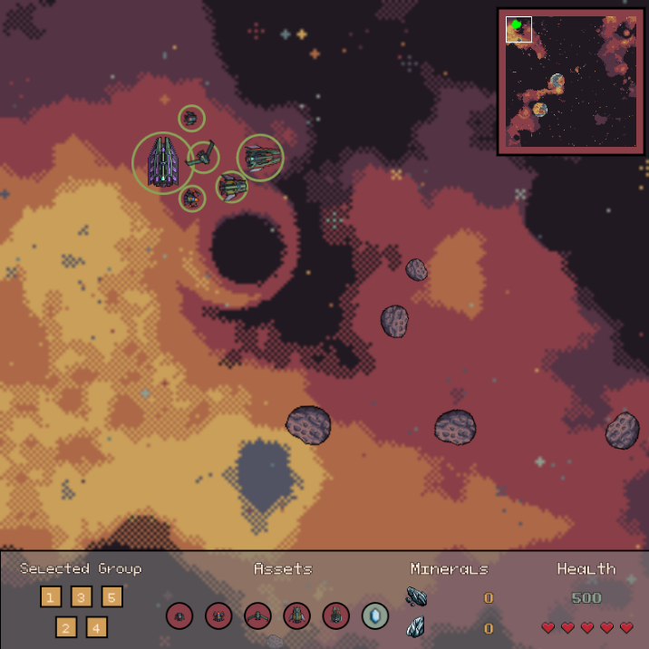

# JamesJam 2023 - Group 8

This is our team's project for the 2023 JamesJam. This year, the theme of the Game Jam was to create a game in similar nature to Homeworld (1999).

In Homeworld, the player has a central, large, ship which commands smaller ships with individual tasks - such as combat, resource collection, etc. Given the option between a sea-themed game or a space-themed game, our team decided a space-themed game would both look better, and be easier to manage in the long-term.

In the JamesJam, groups are given two weeks to construct a game given the theme using P5.js. This year, P5Play v3 was released, meaning that groups had a larger range of features and options available to utilise.

## Difficulties

Overall, our group did not experience too many gamebreaking, or development slowing issues. However, some annoyances inside the way p5 was written did hinder the development of some features. For example, p5play draws sprites at the end of the p5 draw cycle in its own post function. While this normally is not an issue, it does mean that sprites will be overlayed over any vanilla p5 functions such as rect or line. In particular, the UI contains elements of regular text on top of a transparent rectangle. This meant that text would always appear behind the background, or asteroids would move in front of the text, making it incredibly hard to read.

Thankfully, there is a solution. By creating a seperate function in the UI class to draw this text, it can then be called at the end of the p5play library's post function, making it be the very last thing drawn before a new cycle. In the future, the transparents rectangle should be moved to being its own sprite, and using p5plays built in sprite.update function can further vanilla p5 draw functions be called.

## Screenshots

## Authors

Group 8

- [@NickBland](https://www.github.com/NickBland)
- [@Jesse-Caitlyn-James](https://www.github.com/Jesse-Caitlyn-James)
- [@Alice-Bui](https://www.github.com/Alice-Bui)

James (GameJam Coordinator)

- [@JamesBakerMM](https://github.com/JamesBakerMM)
